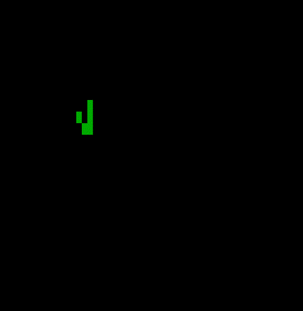

# life
A Conway's Game of Life implementation in Go.

```sh
Usage of life:
  -color string
    	The cell color. (default "green")
  -gen int
    	Number of generations. (default 100)
  -seed string
    	Name of a seed to use (default "glider")
  -speed int
    	The speed (higher=slower). (default 100)
```

## seed examples

### Glider (Spaceship)
```sh
$ life -speed=25
```



### DieHard (Methuselah)
```sh
$ life -seed=diehard -gen=100 -speed=70 -color=cyan
```


### R Pentomino (Methuselah)
```sh
$ life -seed=rpentomino -gen=700 -speed=30 -color=magenta
```


### Acorn (Methuselah)
```sh
life -seed=acorn -gen=750 -speed=50 -color=yellow
```
